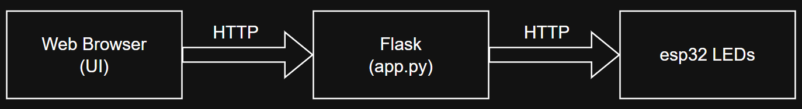

# Light-App

This is an app I made for fun because i needed some LED lights for my DnD sessions.

It's basically a small web-based lighting controller. It lets you control multiple "LED stations", controlled by esp32s, from a single web interface, making it possible to create atmospheric lighting effects for different scenes, locations, and encounters.

To track what stations I have an where they are I'm using a dictionary that i change before launching the server (this can and will be updated in the future)
git 